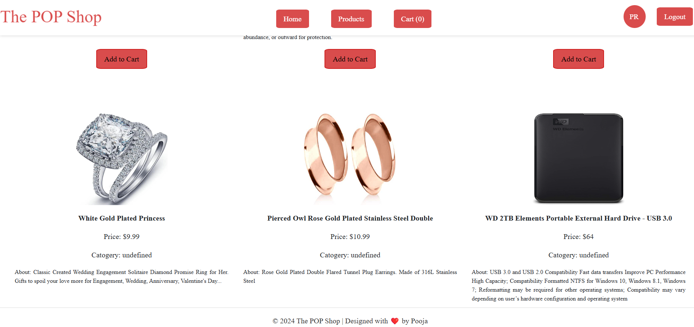
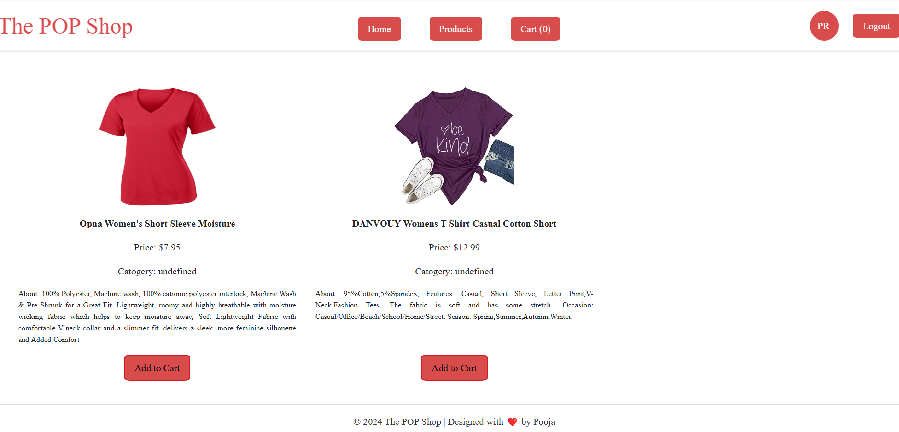
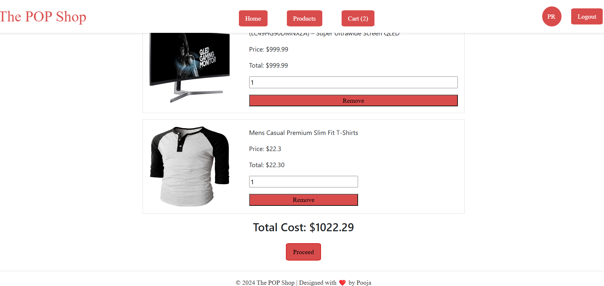
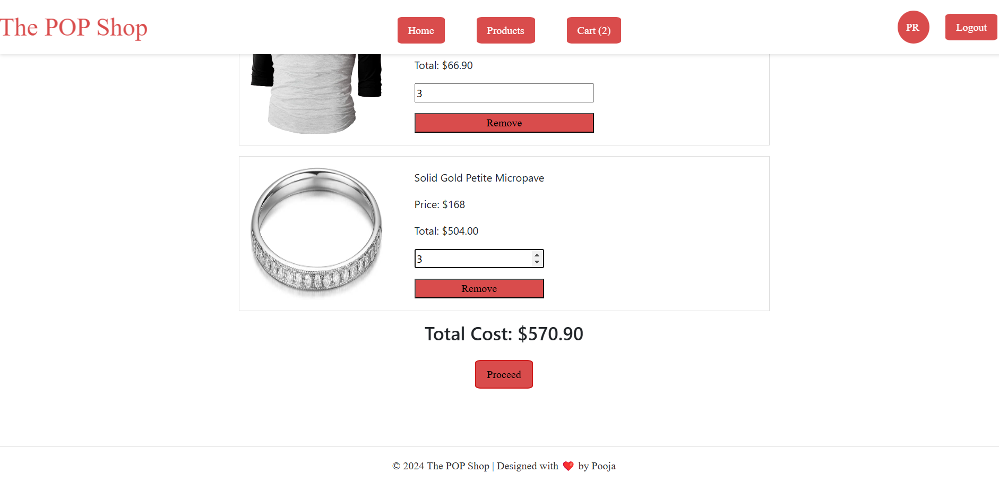
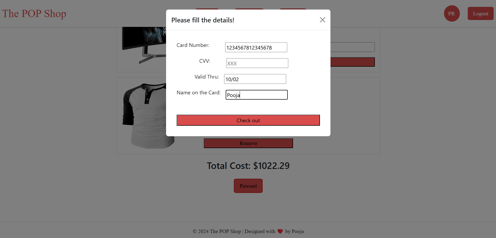
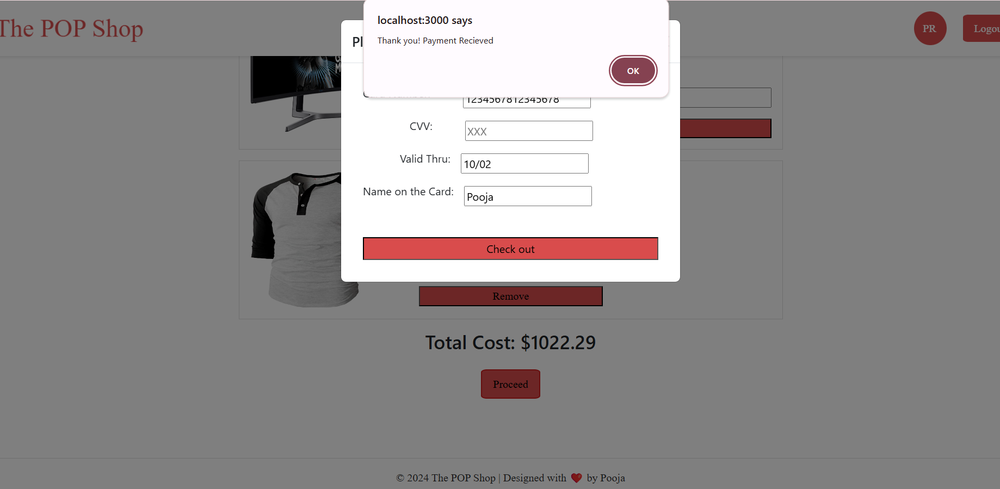
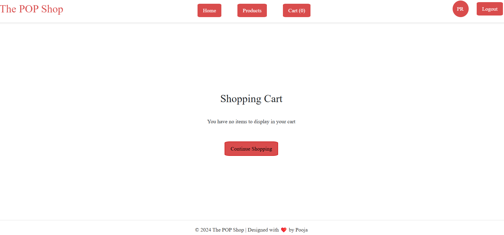

PopShop-
PopShop is a web-based e-commerce application that allows users to browse products, add them to a cart, and complete their purchases seamlessly. This repository contains all the necessary files for deploying and managing the application.

Screenshots-

Loginpage:

Homepage:

Productspage:

Cartpage:

Checkout:

Payment-successfull:

Continueshopping:

Features-
1. Login Page (User Authentication):
* The Login Page accepts any user credentials (username and password) without validation.
* The "Login" button remains disabled until both fields are populated, after which it becomes active.
2. Home Page:
* After a successful login, the user is redirected to the Home Page.
* Includes a navigation menu with options such as Home, Products, Shopping Cart, and Contact.
* Displays the user's Avatar along with a Logout button at the top.
3. Products Page (Product Listings):
* Dynamically displays products fetched from the PHP backend, which pulls data from an external API.
* Product details include title, price, category, description, and image.
* Each product has an "Add to Cart" button, which navigates to the Cart Page.
4. Cart Page (Shopping Cart):
* Lists all the items added to the cart.
* Users can adjust the quantity of each item, and the total price updates dynamically.
* Allows adding multiple items to the cart.
* A "Process" button opens a modal for entering card details.
5. Checkout (Payment Successful):
* Provides a seamless checkout process with payment integration.
* After entering card details, a confirmation alert notifies the user of successful payment.
* Redirects the user back to the Home Page.
6. Responsive Design:
* Ensures a mobile-friendly experience, with functionality across devices.

Setup and Installation-
Prerequisites:
Ensure the following are installed on your system:
* Node.js
* npm (Node Package Manager)
* Git
* A browser to access the web app.
Installation Steps:
1. Clone the Repository:
git clone https://github.com/rajupooja1211/PopShop.git
2. Navigate to the PopShop Directory and Install Dependencies:
cd frontend
npm install
3. Start the PHP Server:
php -S localhost:8000 -t backend
4. Run the Application:
npm start
The application will be available at http://localhost:3000.

Technologies Used-
Frontend:
* React: For creating a dynamic and responsive user interface.
* Bootstrap: For consistent and modern styling of components.
* Redux: For efficient state management, particularly for handling cart functionality.
* React Router: For seamless navigation between pages.
Backend:
* PHP: For managing API calls and serving data to the frontend.
* cURL in PHP: To fetch data from an external API and integrate it into the application

